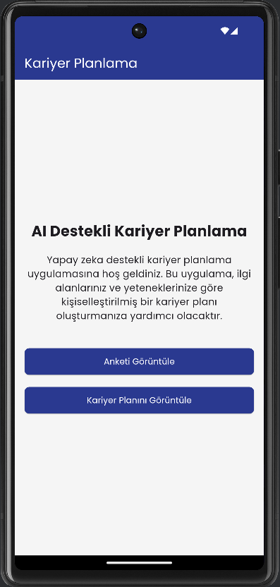
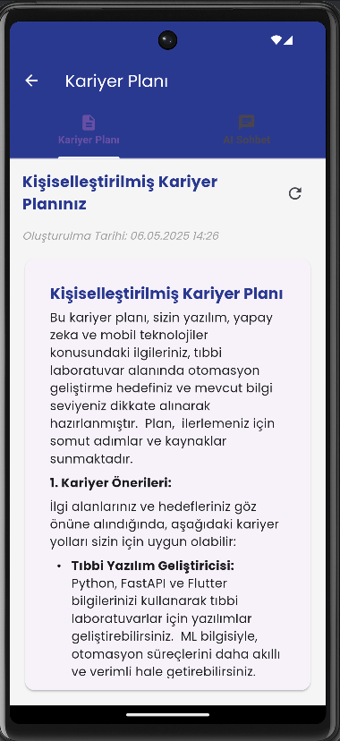

# YZTA-Group-77 AI Destekli Kariyer Planlama Projesi

Bu proje, yapay zeka destekli bir kariyer planlama sistemi içerir. Kullanıcıların sorulara verdikleri cevaplara göre kişiselleştirilmiş kariyer planları oluşturur ve yapay zeka ile kariyer planı üzerinde sohbet etmelerini sağlar.

<p align="center">
  
  
  
</p>

## Özellikler

- **AI Destekli Dinamik Anket**: Gemini API kullanarak kullanıcılara kişiselleştirilmiş 10 soru yöneltir
- **Kişiselleştirilmiş Kariyer Planı**: Kullanıcının cevaplarına göre detaylı ve kapsamlı bir kariyer planı oluşturur
- **AI Sohbet Desteği**: Hazırlanan kariyer planı hakkında yapay zeka ile sohbet etme imkanı
- **Modern ve Kullanıcı Dostu Arayüz**: Flutter ile geliştirilmiş mobil uygulama
- **Esnek Entegrasyon**: FastAPI tabanlı backend API ve Flutter tabanlı mobil uygulama

## Proje Yapısı

Proje iki ana bölümden oluşmaktadır:

1. `app/` - Python/FastAPI ile yazılmış backend API
2. `flutter_client/` - Flutter ile yazılmış mobil uygulama

## Backend API (FastAPI)

FastAPI tabanlı backend, aşağıdaki özelliklere sahiptir:

- Dinamik AI destekli anket sistemi (10 soru)
- Kişiselleştirilmiş kariyer planı oluşturma
- AI ile sohbet arayüzü
- Asenkron veri işleme
- SQLite veritabanı ile veri saklama

Backend projenin detayları için [app/README.md](app/README.md) dosyasına bakabilirsiniz.

## Mobil Uygulama (Flutter)

Flutter tabanlı mobil uygulama, backend API ile entegre çalışarak kullanıcılara aşağıdaki özellikleri sunar:

- Kullanıcıya özgü dinamik anket soruları
- Yapay zeka destekli kişiselleştirilmiş kariyer planı görüntüleme
- Kariyer planı hakkında yapay zeka ile sohbet edebilme
- Güzel ve kullanıcı dostu arayüz

Mobil uygulama detayları için [flutter_client/README.md](flutter_client/README.md) dosyasına bakabilirsiniz.

## Nasıl Çalışır?

1. **Kullanıcıya Dinamik Sorular**: Kullanıcı anketi başlattığında, AI kullanıcının profiline uygun sorular yöneltir
2. **Kişisel Bilgi Toplama**: Kullanıcının yanıtları doğrultusunda, sonraki sorular daha spesifik ve kişiselleştirilmiş hale gelir
3. **AI Destekli Kariyer Planı**: Tüm sorulara verilen yanıtlar analiz edilerek, kişiselleştirilmiş bir kariyer planı oluşturulur
4. **Etkileşimli Sohbet**: Oluşturulan plan hakkında AI ile sohbet ederek daha fazla detay alınabilir

## Kurulum ve Çalıştırma

### Gereksinimler

- Python 3.9 veya üstü
- Flutter SDK 3.0.0 veya üstü
- Google AI API anahtarı (Gemini API)

### Backend API Kurulumu

1. Sanal ortam oluşturun ve etkinleştirin:
```bash
# Windows
python -m venv venv
venv\Scripts\activate

# macOS/Linux
python3 -m venv venv
source venv/bin/activate
```

2. Gerekli Python paketlerini yükleyin:
```bash
pip install -r requirements.txt
```

3. `.env` dosyasını oluşturun:
```
GOOGLE_API_KEY=your_gemini_api_key_here
DATABASE_URL=sqlite:///./career_planner.db
```

4. API'yi başlatın:
```bash
uvicorn main:app --reload
```

API varsayılan olarak http://localhost:8000 adresinde çalışacaktır.

### Flutter Uygulaması Kurulumu

1. Flutter bağımlılıklarını yükleyin:
```bash
cd flutter_client
flutter pub get
```

2. `.env` dosyasını oluşturun:
```
API_BASE_URL=http://localhost:8000
EMAIL=test@example.com
```

3. Uygulamayı çalıştırın:
```bash
flutter run
```

## Uygulama Ekranları

### Ana Ekran
Ana ekranda kullanıcılar anket sürecini başlatabilir ve mevcut durumlarını görüntüleyebilirler.

<p align="center">
  
</p>

### Anket Tamamlandı Ekranı
Tüm soruları yanıtladıktan sonra, kullanıcı kariyer planı oluşturma seçeneğini görür.

<p align="center">
  
</p>

### Kariyer Planı Ekranı
Oluşturulan kariyer planı, markdown formatında detaylı bir şekilde görüntülenir ve kullanıcı AI ile sohbet edebilir.

<p align="center">
  
</p>

## Teknolojiler

- **Backend**: Python, FastAPI, SQLite, Gemini API
- **Frontend**: Flutter, Dart, Provider state management

### Backend Geliştiricileri İçin
- FastAPI ve SQLite ile veritabanı işlemleri `app/database/` klasöründe
- Gemini API entegrasyonu `app/services/` klasöründe
- API endpoint'leri `app/routers/` klasöründe
- Veri modelleri `app/schemas/` klasöründe 

### Mobil Geliştiricileri İçin
- API iletişimi ve state yönetimi `flutter_client/lib/services/` klasöründe
- Ekranlar `flutter_client/lib/screens/` klasöründe
- Veri modelleri `flutter_client/lib/models/` klasöründe
- UI bileşenleri `flutter_client/lib/widgets/` klasöründe

