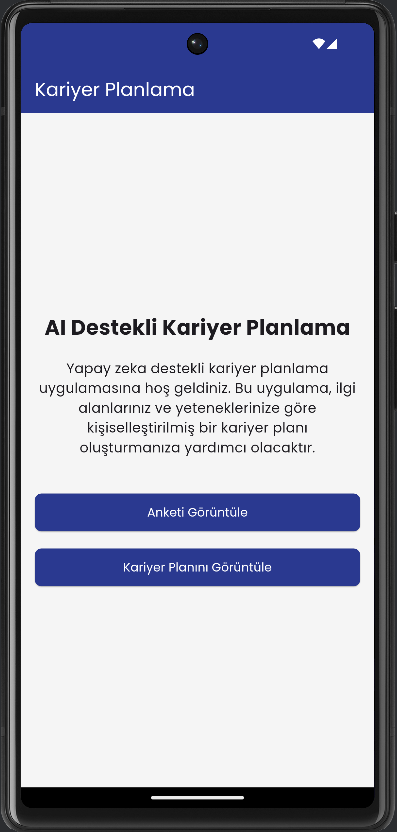
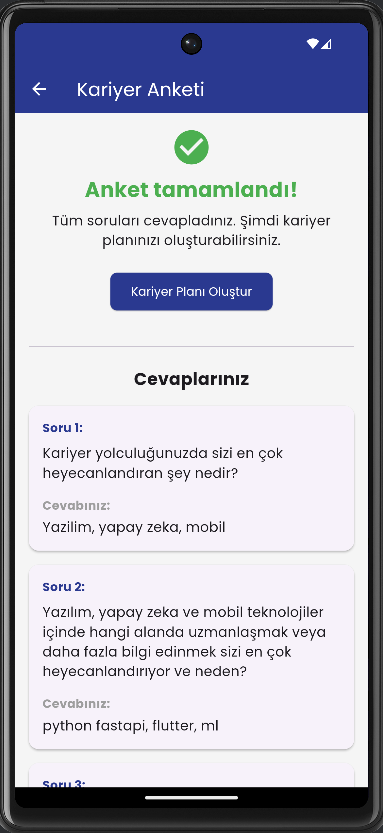
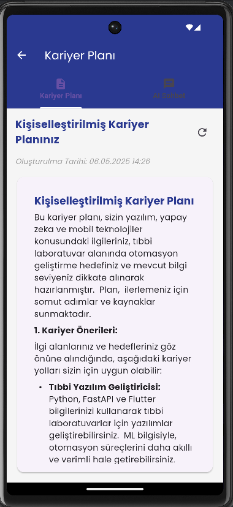

# AI Kariyer Planlama API

Gemini API kullanarak AI destekli kariyer planlaması yapan bir FastAPI uygulaması. Bu uygulama, kullanıcılardan dinamik sorular aracılığıyla bilgi toplar, yanıtlarına dayalı olarak kişiselleştirilmiş kariyer planları oluşturur ve bu planlar hakkında etkileşimli AI sohbeti sunar.

<p align="center">
  
  
  
</p>

## Özellikler

- **Dinamik AI Destekli Soru-Cevap**: Gemini API ile kişiselleştirilmiş 10 soru
- **Kişiselleştirilmiş Kariyer Planı Oluşturma**: Kullanıcının cevaplarına dayalı olarak detaylı kariyer yol haritası
- **AI Sohbet Arayüzü**: Kariyer planı hakkında konuşmak ve detaylandırmak için etkileşimli sohbet
- **Async/Await API**: Tüm işlemler asenkron yapıda
- **SQLite Veritabanı**: Kullanıcı verileri, sorular, cevaplar ve kariyer planlarını saklama

## Teknoloji Yığını

- **Backend**: Python 3.9+, FastAPI
- **Veritabanı**: SQLite (aiosqlite)
- **AI Entegrasyonu**: Gemini API (google-genai)
- **Veri Doğrulama**: Pydantic v2
- **API Dokümantasyonu**: OpenAPI (Swagger UI)

## Proje Yapısı

```
app/
├── config/               # Yapılandırma dosyaları
│   └── settings.py      # Uygulama ve API ayarları
├── database/            # Veritabanı işlemleri
│   └── database.py      # SQLite veritabanı işlevleri
├── routers/             # API endpoint'leri
│   ├── career_plan.py   # Kariyer planı işlemleri
│   └── questionnaire.py # Anket işlemleri
├── schemas/             # Pydantic şemaları
│   └── schemas.py       # Veri doğrulama şemaları
├── services/            # Harici servis entegrasyonları  
│   └── gemini_service.py # Gemini API entegrasyonu
└── __init__.py          # Paket tanımı
```

## Uygulamanın Çalışma Aşamaları

### 1. Ana Ekran: Anket Başlangıcı
<p align="center">
  
</p>

Uygulama başladığında kullanıcıya anket durumunu gösterir. Henüz anket tamamlanmamışsa, kullanıcı anketi başlatabilir.

### 2. Anket Tamamlanma Ekranı
<p align="center">
  
</p>

Tüm sorular yanıtlandıktan sonra, kullanıcı kariyer planı oluşturma seçeneğine sahip olur.

### 3. Kariyer Planı ve AI Sohbet
<p align="center">
  
</p>

Oluşturulan kariyer planı, detaylı bölümler içerir ve kullanıcı AI ile sohbet ederek daha fazla bilgi alabilir.

## Detaylı Bileşen Açıklamaları

### 1. Veritabanı Yapısı (`app/database/database.py`)

Uygulama SQLite veritabanı kullanır ve aşağıdaki tabloları içerir:

- **users**: Kullanıcı bilgilerini saklar (id, email, created_at)
- **questionnaire**: Soru-cevap etkileşimlerini saklar (id, user_id, question_number, question, answer, created_at)
- **career_plans**: Oluşturulan kariyer planlarını saklar (id, user_id, plan_content, created_at)
- **conversations**: AI ile sohbet geçmişini saklar (id, user_id, message, is_user, created_at)

Veritabanı işlevleri asenkron olarak tasarlanmıştır ve aiosqlite kütüphanesi kullanır.

### 2. Gemini API Entegrasyonu (`app/services/gemini_service.py`)

Gemini API ile iletişim kuran dört ana fonksiyon içerir:

- **generate_first_question()**: İlk soruyu oluşturur
- **generate_next_question()**: Önceki yanıtlara dayalı sonraki soruyu oluşturur
- **generate_career_plan()**: Tüm yanıtlara dayalı kariyer planı oluşturur
- **process_user_query()**: Kullanıcı sorularını yanıtlar

Bu fonksiyonlar, Gemini API'sinin güncel `google-genai` kütüphanesini kullanır ve hata yönetimi içerir.

### 3. API Yönlendiricileri

#### Anket Yönlendiricisi (`app/routers/questionnaire.py`)

Kullanıcı anketi için endpoint'leri içerir:

- **GET /questionnaire/status**: Anket tamamlama durumunu kontrol eder
- **GET /questionnaire/question**: Sonraki soruyu getirir
- **POST /questionnaire/answer**: Cevabı kaydeder
- **GET /questionnaire/answers**: Tüm cevapları getirir

#### Kariyer Planı Yönlendiricisi (`app/routers/career_plan.py`)

Kariyer planları için endpoint'leri içerir:

- **POST /career-plan/generate**: Kariyer planı oluşturur
- **GET /career-plan/**: Oluşturulan kariyer planını getirir
- **POST /career-plan/chat**: Kariyer planı hakkında AI ile sohbet eder
- **GET /career-plan/chat-history**: Sohbet geçmişini getirir

### 4. Veri Şemaları (`app/schemas/schemas.py`)

Pydantic modelleri ile API istekleri ve yanıtları için veri doğrulama şemaları:

- **Kullanıcı şemaları**: UserBase, UserCreate, UserResponse
- **Soru-cevap şemaları**: QuestionAnswerBase, QuestionAnswer, QuestionResponse, AnswerCreate
- **Kariyer planı şemaları**: CareerPlanResponse
- **Konuşma şemaları**: MessageBase, UserMessage, AIMessage, ConversationMessage
- **API yanıt şemaları**: SuccessResponse, ErrorResponse, QuestionnaireCompletionResponse

### 5. Uygulama Yapılandırması (`app/config/settings.py`)

Pydantic-settings kullanarak uygulama ayarlarını yönetir:

- Uygulama adı, sürümü ve açıklaması
- Veritabanı bağlantı URL'si
- Gemini API anahtarı ve model adı

## Kurulum

1. Ana dizinde olduğunuzdan emin olun ve sanal ortam oluşturup etkinleştirin:
   ```bash
   # Windows
   python -m venv venv
   venv\Scripts\activate
   
   # macOS/Linux
   python3 -m venv venv
   source venv/bin/activate
   ```

2. Bağımlılıkları yükleyin:
   ```bash
   pip install -r requirements.txt
   ```

3. `.env` dosyası oluşturun veya düzenleyin:
   ```
   GOOGLE_API_KEY=your-gemini-api-key
   DATABASE_URL=sqlite:///./career_planner.db
   ```

4. API'yi başlatın:
   ```bash
   uvicorn main:app --reload
   ```

5. Tarayıcıda API dökümantasyonuna erişin: `http://localhost:8000/docs`

## API Akış Şeması

Uygulamanın tipik kullanım akışı:

1. **Kullanıcı Kaydı/Tanımlama**:
   - Kullanıcılar e-posta adresleriyle tanımlanır
   - İlk istekte, sistem kullanıcıyı otomatik olarak oluşturur

2. **Anket Süreci**:
   - İlk soru alınır (`GET /questionnaire/question`)
   - Kullanıcı cevap gönderir (`POST /questionnaire/answer`)
   - Bu işlem 10 soru tamamlanana kadar tekrarlanır
   - Anket durumu kontrol edilebilir (`GET /questionnaire/status`)

3. **Kariyer Planı Oluşturma**:
   - Tüm sorular cevaplandıktan sonra kariyer planı oluşturulur (`POST /career-plan/generate`)
   - Oluşturulan plan görüntülenir (`GET /career-plan/`)

4. **AI ile Sohbet**:
   - Kullanıcı kariyer planı hakkında sorular sorabilir (`POST /career-plan/chat`)
   - Sohbet geçmişi görüntülenebilir (`GET /career-plan/chat-history`)

## API Endpoint'lerinin Detaylı Kullanımı

### Anket Endpointleri

#### 1. Anket Durumunu Kontrol Etme
```http
GET /questionnaire/status?email=kullanici@ornek.com
```

**Yanıt:**
```json
{
  "is_complete": false,
  "total_questions": 10,
  "current_question": 2,
  "next_question": "Yazılım geliştirme alanında hangi dillerde ve çerçevelerde deneyiminiz var?"
}
```

#### 2. Sonraki Soruyu Alma
```http
GET /questionnaire/question?email=kullanici@ornek.com
```

**Yanıt:**
```json
{
  "question": "Kendinizi en iyi tanımlayan üç ilgi alanınız nedir?",
  "question_number": 1
}
```

#### 3. Cevap Gönderme
```http
POST /questionnaire/answer?email=kullanici@ornek.com&question_number=1
Content-Type: application/json

{
  "answer": "Yazılım geliştirme, yapay zeka ve veri analizi."
}
```

**Yanıt:**
```json
{
  "success": true,
  "message": "Cevap başarıyla kaydedildi"
}
```

#### 4. Tüm Cevapları Görüntüleme
```http
GET /questionnaire/answers?email=kullanici@ornek.com
```

**Yanıt:**
```json
[
  {
    "question_number": 1,
    "question": "Kendinizi en iyi tanımlayan üç ilgi alanınız nedir?",
    "answer": "Yazılım geliştirme, yapay zeka ve veri analizi."
  },
  {
    "question_number": 2,
    "question": "Yazılım geliştirme alanında hangi dillerde ve çerçevelerde deneyiminiz var?",
    "answer": "Python, JavaScript, FastAPI, React."
  }
  // ...diğer cevaplar
]
```

### Kariyer Planı Endpointleri

#### 1. Kariyer Planı Oluşturma
```http
POST /career-plan/generate?email=kullanici@ornek.com
```

**Yanıt:**
```json
{
  "success": true,
  "message": "Kariyer planı başarıyla oluşturuldu ve kaydedildi"
}
```

#### 2. Kariyer Planını Görüntüleme
```http
GET /career-plan/?email=kullanici@ornek.com
```

**Yanıt:**
```json
{
  "plan_content": "**Kariyer Planı: Yapay Zeka ve Veri Bilimi Uzmanı**\n\nBu kariyer planı, sizin yazılım geliştirme, yapay zeka ve veri analizi alanlarındaki ilgi alanlarınıza...",
  "created_at": "2025-05-05T15:43:01.999458"
}
```

#### 3. AI ile Sohbet Etme
```http
POST /career-plan/chat?email=kullanici@ornek.com
Content-Type: application/json

{
  "message": "Yapay zeka alanında hangi sertifikaları almamı önerirsiniz?"
}
```

**Yanıt:**
```json
{
  "response": "Merhaba! Yapay zeka alanında kariyer gelişiminiz için alabileceğiniz bazı değerli sertifikalar şunlardır..."
}
```

#### 4. Sohbet Geçmişini Görüntüleme
```http
GET /career-plan/chat-history?email=kullanici@ornek.com
```

**Yanıt:**
```json
{
  "history": [
    {
      "message": "Yapay zeka alanında hangi sertifikaları almamı önerirsiniz?",
      "is_user": true,
      "created_at": "2025-05-05T15:45:23.876543"
    },
    {
      "message": "Merhaba! Yapay zeka alanında kariyer gelişiminiz için alabileceğiniz bazı değerli sertifikalar şunlardır...",
      "is_user": false,
      "created_at": "2025-05-05T15:45:25.123456"
    }
  ]
}
```


## Geliştirici Notları

1. **Yeni Endpoint Eklemek**:
   - İlgili `app/routers/` klasörüne yeni endpoint'ler ekleyebilirsiniz
   - Yeni eklenen yönlendiricileri `main.py` dosyasında kaydetmeyi unutmayın

2. **Veritabanı Şemasında Değişiklik**:
   - `app/database/database.py` dosyasında tablo yapılarını değiştirebilirsiniz
   - Değişikliklerden sonra uygulama ilk çalıştırıldığında tabloları otomatik oluşturacaktır

3. **AI İstek Şablonlarını Değiştirme**:
   - `app/services/gemini_service.py` dosyasında AI istek şablonlarını (promptları) düzenleyebilirsiniz
   - Prompt mühendisliği için titiz testler yapmanız önerilir

4. **Hata Ayıklama**:
   - API'de oturum açma etkinleştirilmiştir
   - Hata ayıklama için logları kontrol edin
   - Swagger UI (`/docs`) endpoint'leri test etmek için kullanılabilir

5. **Performans İyileştirmeleri**:
   - Gemini API çağrıları, uzun yanıt süreleri nedeniyle asenkron olarak yapılır
   - Büyük ölçekli dağıtımlar için önbellek mekanizmaları ekleyebilirsiniz