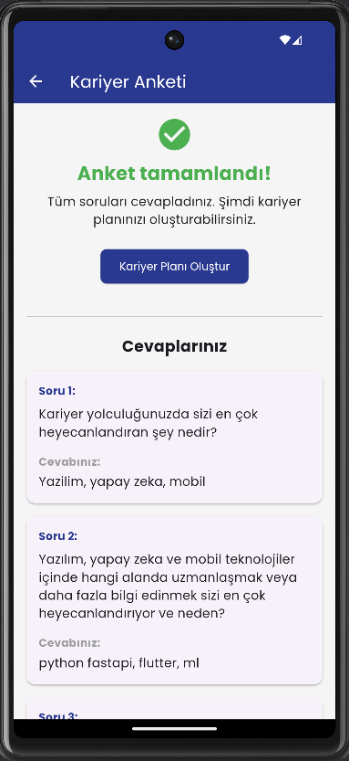

# Kariyer Planlama Mobil Uygulaması

Bu uygulama, AI destekli kariyer planlama backend API'si ile entegre çalışan bir Flutter mobil uygulamasıdır.

<p align="center">
  
  
  
</p>

## Özellikler

- **Dinamik Anket Sistemi**: Backend API'den gelen kişiselleştirilmiş anket soruları
- **Kişiselleştirilmiş Kariyer Planı**: Yapay zeka destekli özel kariyer planı görüntüleme
- **AI Sohbet Arayüzü**: Kariyer planı hakkında yapay zeka ile etkileşimli sohbet
- **Modern UI Tasarımı**: Material Design tabanlı kullanıcı dostu arayüz
- **State Yönetimi**: Provider pattern ile etkili durum yönetimi
- **Asenkron Veri İşleme**: API isteklerini yönetmek için asenkron programlama

## Teknik Detaylar

- **Frontend**: Flutter SDK
- **State Yönetimi**: Provider package
- **API İletişimi**: HTTP package
- **Markdown Gösterimi**: Flutter Markdown package
- **Animasyonlar**: Loading Animation Widget package
- **Çevre Değişkenleri**: Flutter Dotenv package

## Proje Yapısı

```
flutter_client/
├── lib/
│   ├── config/             # Yapılandırma dosyaları
│   │   └── env.dart        # Çevre değişkenleri
│   ├── models/             # Veri modelleri
│   │   ├── api_response.dart      # API yanıt modelleri
│   │   ├── career_plan.dart       # Kariyer planı modeli
│   │   ├── conversation_message.dart # Sohbet mesajı modeli
│   │   ├── question.dart          # Soru modeli
│   │   ├── questionnaire_status.dart # Anket durumu modeli
│   │   └── user.dart              # Kullanıcı modeli
│   ├── screens/            # Uygulama ekranları
│   │   ├── home_screen.dart       # Ana ekran
│   │   ├── questionnaire_screen.dart # Anket ekranı
│   │   └── career_plan_screen.dart  # Kariyer planı ekranı
│   ├── services/           # Servisler ve state yönetimi
│   │   ├── api_service.dart       # API iletişim servisi
│   │   ├── questionnaire_provider.dart # Anket state yönetimi
│   │   └── career_plan_provider.dart  # Kariyer planı state yönetimi
│   ├── widgets/            # Yeniden kullanılabilir UI bileşenleri (gerekirse eklenebilir)
│   └── main.dart           # Uygulama giriş noktası
├── assets/
│   ├── fonts/              # Yazı tipleri
│   └── images/             # Görüntüler
├── .env                    # Çevre değişkenleri dosyası (oluşturulacak)
└── pubspec.yaml            # Bağımlılıklar ve yapılandırma
```

## Ekran Görüntüleri ve Açıklamaları

### Ana Ekran
<p align="center">
  
</p>

Ana ekranda kullanıcılar anket sürecini başlatabilir, mevcut tamamlama durumunu görüntüleyebilir ve kariyer planı ekranına geçiş yapabilirler.

### Anket Tamamlandı Ekranı
<p align="center">
  
</p>

Tüm sorular yanıtlandıktan sonra, kullanıcı kariyer planı oluşturma seçeneğini görür. Bu ekranda ayrıca anket cevapları da listelenebilir.

### Kariyer Planı Ekranı
<p align="center">
  
</p>

Oluşturulan kariyer planı, markdown formatında detaylı bir şekilde görüntülenir. Kullanıcı ayrıca sağ üst köşedeki sekme ile AI sohbet moduna geçebilir.

## Kurulum

### Gereksinimler

- Flutter SDK (3.0.0 veya üstü)
- Dart SDK (2.17.0 veya üstü)
- Çalışan bir backend API (FastAPI uygulaması)

### Adımlar

1. Bu depoyu klonlayın:
   ```bash
   git clone https://github.com/tugberksentepe/YZTA-Group-77-CareerPlanning-wAI.git
   cd YZTA-Group-77-CareerPlanning-wAI/flutter_client
   ```

2. Bağımlılıkları yükleyin:
   ```bash
   flutter pub get
   ```

3. Uygulama köküne `.env` dosyası oluşturun:
   ```
   API_BASE_URL=http://localhost:8000
   EMAIL=test@example.com
   ```

   > Not: API_BASE_URL, backend API'nizin çalıştığı URL olmalıdır. Yerel geliştirmede genellikle "http://localhost:8000" olur. EMAIL değeri, API iletişiminde kullanılan varsayılan kullanıcı e-postasıdır.

4. Uygulamayı çalıştırın:
   ```bash
   flutter run
   ```

## Uygulama Akışı

1. **Giriş**: Uygulama açıldığında, `HomeScreen` kullanıcıyı karşılar
2. **Anket**: "Anketi Başlat" butonuna tıklanarak `QuestionnaireScreen` açılır
   - Kullanıcı soruları sırayla yanıtlar
   - Cevaplar API'ye kaydedilir
   - Tüm sorular tamamlandığında anket tamamlanmış sayılır
3. **Kariyer Planı**: Anket tamamlandıktan sonra, "Kariyer Planı Oluştur" butonuyla `CareerPlanScreen` açılır
   - Kariyer planı varsa görüntülenir, yoksa oluşturulabilir
   - Plan içeriği markdown formatında gösterilir
   - Kullanıcı planla ilgili AI'a sorular sorabilir

## Geliştirici Notları - Teknik Detaylar

### 1. Yeni Ekranlar Eklemek

Yeni bir ekran eklemek için:

1. `lib/screens/` klasöründe yeni bir dart dosyası oluşturun
2. Ekranınızı `StatelessWidget` veya `StatefulWidget` olarak tanımlayın
3. `main.dart` dosyasında rota (route) tanımına ekleyin:

```dart
routes: {
  '/': (context) => const HomeScreen(),
  '/questionnaire': (context) => const QuestionnaireScreen(),
  '/career-plan': (context) => const CareerPlanScreen(),
  '/yeni-ekran': (context) => const YeniEkranWidget(),
},
```

### 2. API Servisine Yeni Metotlar Eklemek

`lib/services/api_service.dart` sınıfına yeni özellikler eklemek için:

1. Yeni API endpoint çağrısını tanımlayan bir metot ekleyin
2. İlgili yanıt modellerini kullanın veya yeni modeller oluşturun

```dart
// Örnek yeni API metodu
Future<YeniModel> yeniFonksiyon(String parametre) async {
  final response = await client.get(
    Uri.parse('$baseUrl/yeni-endpoint?email=$email&param=$parametre'),
  );

  if (response.statusCode == 200) {
    return YeniModel.fromJson(jsonDecode(utf8.decode(response.bodyBytes)));
  } else {
    throw Exception('Veri alınamadı: ${response.body}');
  }
}
```

### 3. Yeni Bir Provider Eklemek

State yönetimi için yeni bir provider eklemek:

1. `lib/services/` klasöründe yeni bir provider dosyası oluşturun
2. Provider sınıfınızı `ChangeNotifier` mixin'i ile tanımlayın
3. `main.dart` dosyasında provider'ı kaydedin:

```dart
MultiProvider(
  providers: [
    ChangeNotifierProvider(
      create: (_) => QuestionnaireProvider(apiService: apiService),
    ),
    ChangeNotifierProvider(
      create: (_) => YeniProvider(apiService: apiService),
    ),
  ],
  ...
);
```

### 4. Hata Yönetimi ve Tip Dönüşümleri

- API hatalarını her zaman try-catch blokları içinde yakalayın
- Kullanıcıya anlamlı hata mesajları gösterin, teknik detayları gizleyin
- Veri modelleri arasında dönüşüm yaparken tip uyuşmazlıklarına dikkat edin:

```dart
// Örnek: API'den int gelen değeri bool'a dönüştürme 
bool isUserBool;
if (json['is_user'] is int) {
  isUserBool = json['is_user'] == 1;
} else {
  isUserBool = json['is_user'] as bool;
}
```